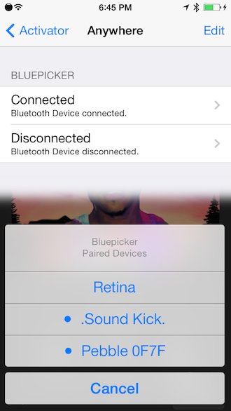

# [Bluepicker](http://insanj.github.io/Bluepicker)

Control Bluetooth devices via Activator.

> Bluepicker allows you to connect and disconnect from paired devices, as well as toggle Bluetooth using simple Activator actions. Choose a device from Bluepicker's selection sheet, and viola! Bluepicker also includes an Activator event, so you can assign any action you want to device connections and disconnections. 

> Use [FlipControlCenter](http://moreinfo.thebigboss.org/moreinfo/depiction.php?file=flipcontrolcenterDp) for Control Center activation.

Supports iOS 5.x-8.x. Requires [Activator](http://rpetri.ch/cydia/activator/). Check [Releases](https://github.com/insanj/Bluepicker/releases) for current builds and screenshots.

## Developers

Bluepicker conveniently registers itself (within SpringBoard) for the `Bluepicker.Start` notification on `NSDistributedNotificationCenter`. If you fire this off, Bluepicker will present an action sheet from the current context, and handle the rest of the work for you.

For example:

    [[NSDistributedNotificationCenter defaultCenter] postNotificationName:@"Bluepicker.Start" object:nil];

## [License](LICENSE.md)

	Bluepicker: Control Bluetooth devices via Activator.
	Copyright (C) 2014-2015 Julian (insanj) Weiss
	
    This program is free software: you can redistribute it and/or modify
    it under the terms of the GNU General Public License as published by
    the Free Software Foundation, either version 3 of the License, or
    (at your option) any later version.

    This program is distributed in the hope that it will be useful,
    but WITHOUT ANY WARRANTY; without even the implied warranty of
    MERCHANTABILITY or FITNESS FOR A PARTICULAR PURPOSE.  See the
    GNU General Public License for more details.

    You should have received a copy of the GNU General Public License
    along with this program.  If not, see <http://www.gnu.org/licenses/>.
